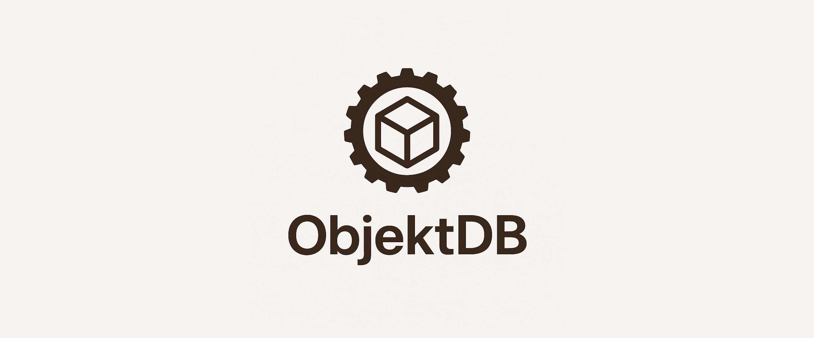

<h1 align="center" style="border-bottom : 0;">OBJEKTDB</h1>
<p align="center"><i>Effortless data management for innovative Rust applications <br/><br/> Built with:</i></p>




<h2 style="border-bottom : 0;">Overview</h2>

**objektDB** is a lightweight, easy-to-use embedded object-oriented database management system (OODBMS) for Rust projects. It allows you to store, retrieve, and manage structured objects directly, preserving their relationships and hierarchies without the need for external database servers. Ideal for small applications, prototyping, or learning purposes, objektDB offers Rust developers persistent object storage with minimal setup and a straightforward API.

### Why objektDB?
This project simplifies persistent object storage, making it ideal for small applications and prototyping. The core features include:
- 🗄️ **Lightweight & Embedded:** No external database servers required, ensuring seamless integration.
- 📦 **Object-Oriented Storage:**  Efficiently manages structured objects while maintaining their relationships.
- ⚡ **Minimal Setup:**  Quick to get started, perfect for rapid prototyping and small applications.
- 🛠️ **User-Friendly API:**  Simplifies interactions with the database, making it accessible for developers.
---
<h2 style="border-bottom : 0;">Getting Started</h2>

### Prerequisites
This project requires the following dependencies:
- **Programming language**: Rust
- **Package manager**: Cargo
### Installation

Add the following to your `Cargo.toml`:

```toml
[dependencies]
objektdb = "0.1"
```

Then import it in your Rust code:

```rust
use objektdb::{objektdb_core::storage_engine::*, objektdb_macros::*};;
```

### Usage
### Example

---
<h2 style="border-bottom : 0;">Restriction</h2>

- We currently support up to 255 tables per database
- Your structs cannot have a name that exceeds 64 characters
- For the time being, you can interact with databases only through the traits implemented by the macros and functions provided by the library: there is no specific language for interacting yet.
<h2 style="border-bottom : 0;">New Version</h2>

- DB file template version: 1